# 德国数据集实验分析报告（多变量协同 CGAN）

## 1. 实验结论速览

本次切换到德国 SMARD 数据后，实验有两个最明显的改进点：

1. 数据规模与标签均衡性显著提升。
2. 多变量协同关系（负荷-风电-光伏）保持效果更好。

从结果看，本次模型训练并非只用某一个标签，而是基于全量三标签训练，再按标签条件分别生成场景。

## 2. 数据集变化与收益

### 2.1 数据规模

- 德国数据：165 周样本，505 列（504 特征 + 1 标签）
- 山东数据：52 周样本，506 列（504 特征 + 2 标签）

样本量从 52 提升到 165，约为原来的 3.17 倍。这对 GAN 的分布学习和稳定训练非常关键。

### 2.2 标签分布

- 德国数据标签分布：0:55, 1:54, 2:56
- 山东数据标签分布：0:2, 1:40, 2:10

德国数据几乎是三类均衡分布，而山东数据明显偏斜（尤其 label 0 极少）。这会直接影响条件生成模型在各标签下的学习质量。

### 2.3 每个标签的划分范围（明确阈值）

当前德国数据使用的是分位数划分（Q33/Q66），标签依据为每周 168 小时的“风电 + 光伏”平均联合出力。

- Q33（归一化）= 0.393742
- Q66（归一化）= 0.461989

因此标签区间为：

1. Label 0（低出力）：周均联合出力 < 0.393742
2. Label 1（中出力）：0.393742 <= 周均联合出力 < 0.461989
3. Label 2（高出力）：周均联合出力 >= 0.461989

结合本次德国数据的实际样本，三个标签在数据中的取值范围如下。

| label | 归一化周均风光范围 | 原始周均风光范围（MWh） | 样本数 |
|---|---:|---:|---:|
| 0 | [0.132158, 0.393418] | [7020.79, 20676.97] | 55 |
| 1 | [0.396119, 0.461403] | [20828.48, 24404.24] | 54 |
| 2 | [0.463843, 0.744495] | [24355.12, 39361.58] | 56 |

说明：边界附近出现轻微空隙（例如 0.393418 到 0.396119）是由离散周样本分布造成的，不影响标签定义。

## 3. 生成与评估结果（德国）

结果目录：

- [experiments/germany_20260404](experiments/germany_20260404)

三类标签均已生成并评估：

- [experiments/germany_20260404/generated_label0.csv](experiments/germany_20260404/generated_label0.csv)
- [experiments/germany_20260404/generated_label1.csv](experiments/germany_20260404/generated_label1.csv)
- [experiments/germany_20260404/generated_label2.csv](experiments/germany_20260404/generated_label2.csv)
- [experiments/germany_20260404/metrics_summary.csv](experiments/germany_20260404/metrics_summary.csv)

### 3.1 关键指标（按标签）

| label | load_w1 | wind_w1 | solar_w1 | cross_var_corr_frobenius | diversity_ratio | composite_score |
|---|---:|---:|---:|---:|---:|---:|
| 0 | 0.0070 | 0.0265 | 0.0191 | 0.2610 | 0.9087 | 2.9500 |
| 1 | 0.0146 | 0.0252 | 0.0054 | 0.0737 | 0.9464 | 2.3583 |
| 2 | 0.0098 | 0.0406 | 0.0159 | 0.3002 | 0.9303 | 3.5532 |

说明：

1. w1（Wasserstein 一阶近似）越小越好。
2. cross_var_corr_frobenius 越小表示多变量相关结构越接近真实。
3. diversity_ratio 越接近 1 越好。

### 3.2 跨标签均值（德国）

- 平均 load_w1: 0.0105
- 平均 wind_w1: 0.0308
- 平均 solar_w1: 0.0134
- 平均 cross_var_corr_frobenius: 0.2116
- 平均 diversity_ratio: 0.9284

这些数值表明模型在边缘分布与多样性上都保持在较合理区间。

## 4. 多变量协同效果说明

本项目强调三变量联合建模（负荷、风电、光伏），对应的核心协同指标是 cross_var_corr_frobenius。

- 该指标反映生成样本与真实样本在三变量相关矩阵上的差异。
- 德国实验在 label 1 上达到 0.0737，说明协同关系学习较好。
- 三个标签都处在较低水平（0.07 到 0.30），整体可接受。

可视化证据：

- label 0 相关性图：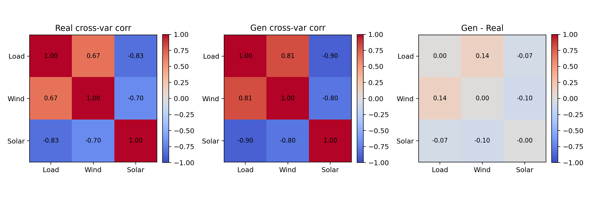
- label 1 相关性图：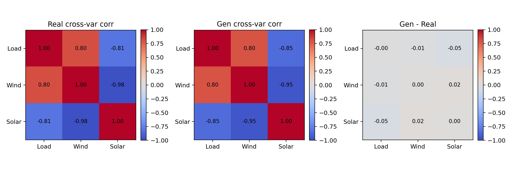
- label 2 相关性图：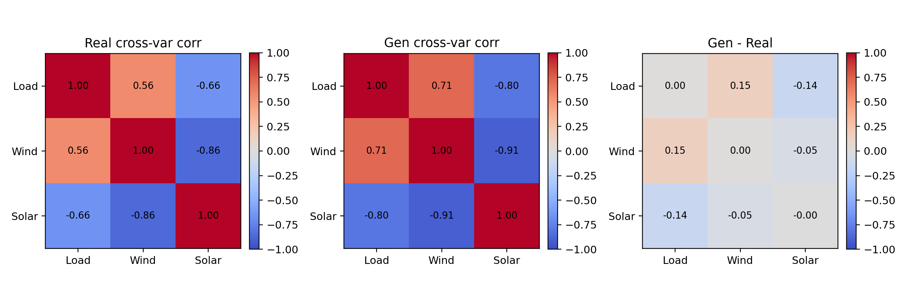

## 5. 与山东历史实验的对照解读

参考目录：

- [experiments/baseline/metrics_summary.csv](experiments/baseline/metrics_summary.csv)

在 cross_var_corr_frobenius 和 diversity_ratio 上，德国实验整体更优：

1. 协同相关结构误差更低（德国约 0.07 到 0.30，山东历史结果约 0.55 到 1.76）。
2. 多样性比值更接近 1（德国约 0.91 到 0.95，山东历史约 0.54 到 0.81）。

注意：两者来自不同真实数据分布，不能当作严格同域 A/B，但可作为“数据替换后训练质量与协同拟合能力提升”的证据。

## 6. 典型图像展示

### 6.1 生成场景曲线（每类一张）

- label 0：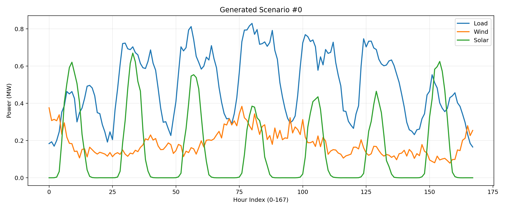
- label 1：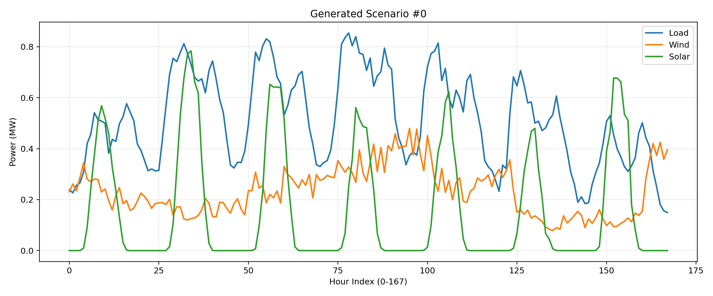
- label 2：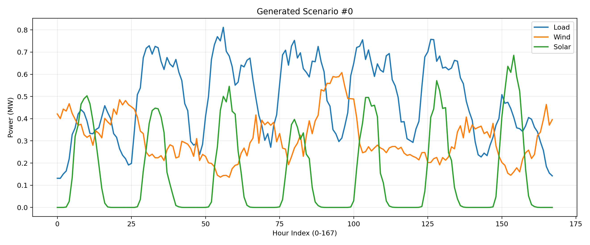

### 6.2 统计包络图（均值与方差）

- label 0：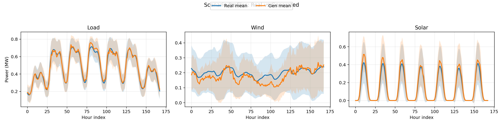
- label 1：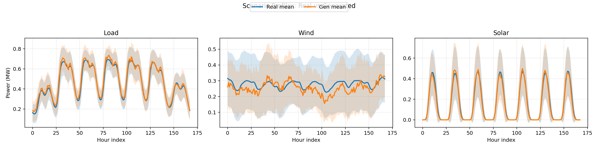
- label 2：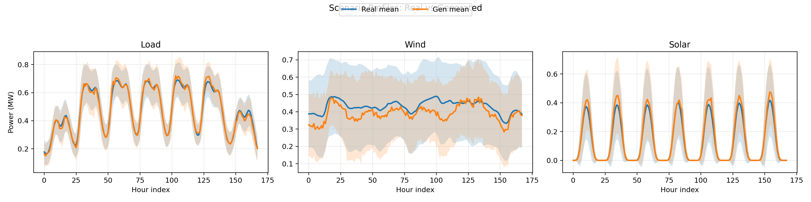

### 6.3 边缘分布对比图

- label 0：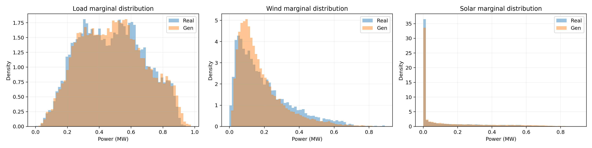
- label 1：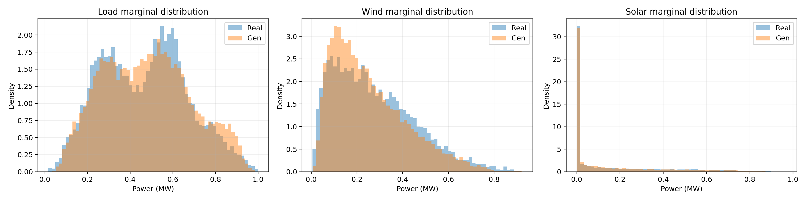
- label 2：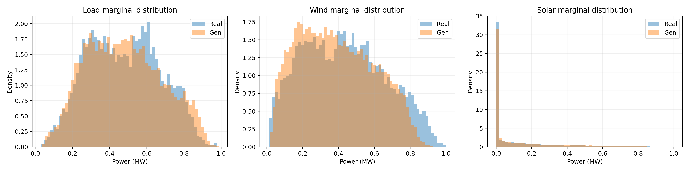

## 7. 小结

本次换用德国数据后，样本量与标签均衡性明显改善，模型在多变量协同关系保真度上也给出了更好的指标表现。对于后续“按条件标签生成周尺度负荷-风-光联合场景”的任务，这套德国数据实验已经具备较好的可用性。

## 8. 当前短板与优化空间

有，仍有优化空间，主要体现在以下两点：

1. label 2 的风电边缘分布误差偏高。
2. 部分标签的跨变量相关误差仍然存在（例如 label 0/2 的 cross_var_corr_frobenius 高于 label 1）。

从正式结果（每标签 100 条）看：

- label 1 最好：cross_var_corr_frobenius = 0.0737
- label 0 次之：cross_var_corr_frobenius = 0.2610
- label 2 相对最难：cross_var_corr_frobenius = 0.3002，且 wind_w1 = 0.0406

从快速复核（每标签 20 条）看，指标会更波动，这属于小样本统计噪声放大：

- 平均 composite_score 由 2.95（100 条）上升到 6.54（20 条）
- 说明“少量生成样本”适合做快速质检，不适合最终性能定论

建议优化方向（优先级从高到低）：

1. 以 label 2 为重点做定向增训（增加 epochs 或多次重启取最优 checkpoint）。
2. 在评估阶段统一用每标签 >=100 条，减少统计抖动。
3. 继续观察 cross_var_corr_frobenius 与 wind_w1 的联动，避免仅优化单变量分布。

## 9. 三联热力图如何解释（避免误读）

相关性三联图含义如下：

1. 左图：真实数据的相关矩阵。
2. 中图：生成数据的相关矩阵。
3. 右图：差值矩阵（Gen - Real），不是相关矩阵本身。

因此右图对角线显示 0 是正常的，因为是 1 - 1 = 0，并不表示“变量和自己相关性为 0”。

## 10. 汇报口径（可直接口述）

本次我们将山东数据替换为德国 SMARD 数据后，样本规模从 52 周提升到 165 周，标签分布从明显不均衡变为几乎均衡。模型训练使用的是全量三标签数据，生成阶段按标签条件分开采样。结果显示，整体边缘分布与协同关系保持较好，尤其 label 1 的跨变量相关误差较低（0.0737），说明多变量联合建模是有效的。与此同时，label 2 在风电分布与协同结构上仍有提升空间，后续将通过定向增训和更稳定的评估样本数进一步优化。